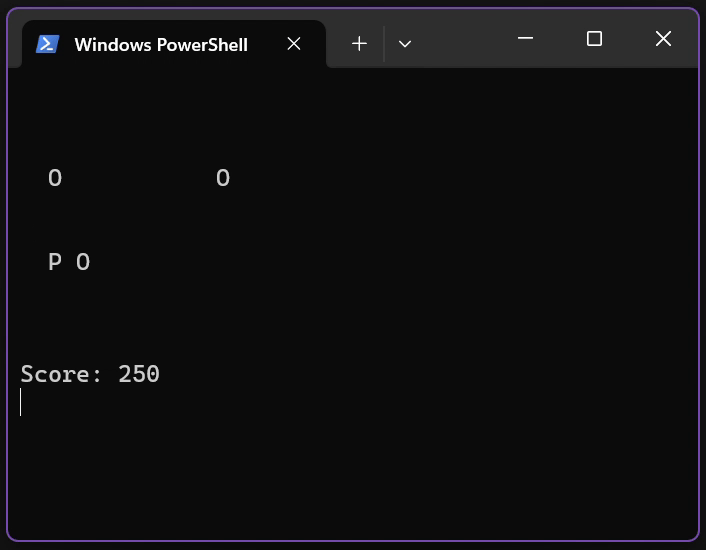

# CPP-Console-DodgeGame



Sebuah game arcade sederhana berbasis konsol yang ditulis dalam C++. Pemain harus menghindari rintangan berbahaya ('X') sambil berusaha mengumpulkan koin ('O') untuk mendapatkan skor tertinggi. Game ini menawarkan pengalaman bermain yang cepat dan responsif langsung di terminal.

---

## Fitur Unggulan

- **Gameplay Sederhana & Adiktif**: Mudah dipelajari, sulit dikuasai! Hindari 'X' dan kumpulkan 'O'.
- **Kontrol Intuitif**: Gerakan pemain sangat responsif dengan tombol keyboard `W` (atas) dan `S` (bawah).
- **Pembaruan Layar Real-time**: Menggunakan `system("cls")` dan `Sleep()` untuk animasi konsol yang mulus.
- **Dua Jenis Objek Interaktif**:
  - **Rintangan Berbahaya ('X')**: Sentuhan berarti Game Over!
  - **Koin Berharga ('O')**: Kumpulkan untuk meningkatkan skor Anda.
- **Sistem Skor**: Tantang diri Anda untuk mencapai skor tertinggi di setiap sesi.
- **Manajemen Memori Efisien**: Menggunakan `vector` dan `delete` untuk mengelola objek secara dinamis.

---

## Cara Bermain

1.  Jalankan program yang sudah dikompilasi (misal: `game.exe` di Windows, `./game` di Linux/macOS) dari terminal Anda.
2.  Anda adalah karakter **'P'** di sisi kiri layar.
3.  Gunakan tombol **`W`** untuk bergerak ke atas.
4.  Gunakan tombol **`S`** untuk bergerak ke bawah.
5.  **Hindari** rintangan **'X'**. Jika Anda menabraknya, permainan berakhir!
6.  **Kumpulkan** koin **'O'**. Setiap koin yang dikumpulkan akan menambah skor Anda.
7.  Untuk keluar dari permainan kapan saja, tekan tombol **`Q`**.

---

## Instalasi dan Kompilasi

Untuk mengompilasi dan menjalankan game ini, Anda memerlukan compiler C++ seperti **MinGW-w64** (untuk Windows) atau **g++** (tersedia di Linux/macOS).

### Persiapan (Jika Belum Ada)

- **MinGW-w64 (Windows)**: Unduh dan instal dari [MinGW-w64](https://mingw-w64.org/doku.php). Pastikan untuk menambahkan direktori `bin` MinGW ke variabel `PATH` sistem Anda agar `g++` dapat diakses dari Command Prompt/PowerShell.
- **g++ (Linux/macOS)**:
  - **Linux (Debian/Ubuntu)**: `sudo apt update && sudo apt install build-essential`
  - **macOS**: Instal Xcode Command Line Tools dengan `xcode-select --install` (g++ akan disertakan).

### Langkah-langkah Kompilasi & Jalankan

1.  **Unduh Repositori**: Clone repositori ini atau unduh file `game.cpp` secara manual.
    ```bash
    git clone [https://github.com/Luthfiyana/CPP-Console-DodgeGame.git](https://github.com/Luthfiyana/CPP-Console-DodgeGame.git)
    cd CPP-Console-DodgeGame
    ```
2.  **Kompilasi**: Buka **Command Prompt**, **PowerShell**, atau **Terminal**, navigasikan ke direktori `CPP-Console-DodgeGame`, lalu kompilasi `game.cpp` menggunakan `g++`:
    ```bash
    g++ game.cpp -o game.exe -std=c++11 -Wall
    ```
    - `-o game.exe`: Menentukan nama file output yang dapat dieksekusi (di Linux/macOS, Anda bisa gunakan `-o game` tanpa `.exe`).
    - `-std=c++11`: Memastikan kompilasi menggunakan standar C++11 untuk kompatibilitas.
    - `-Wall`: Mengaktifkan semua peringatan (sangat direkomendasikan untuk pengembangan yang bersih!).
3.  **Jalankan Game**: Setelah kompilasi berhasil, jalankan program:
    - **Windows**:
      ```bash
      .\game.exe
      ```
    - **Linux/macOS**:
      ```bash
      ./game
      ```

---

## Teknologi yang Digunakan

- **C++**
- **Standard C++ Library** (`iostream`, `vector`, `algorithm`, `ctime`, `string`)
- **`conio.h`**: Untuk input keyboard non-blokir (`_kbhit`, `_getch`) (spesifik Windows).
- **`windows.h`**: Untuk fungsi `Sleep()` dan `system("cls")` (spesifik Windows).

---

## Kontribusi

Kami sangat menyambut kontribusi Anda! Jika Anda memiliki ide untuk fitur baru, perbaikan bug, atau peningkatan performa, jangan ragu untuk:

1.  Buka [Issue baru](https://github.com/Luthfiyana/CPP-Console-DodgeGame/issues).
2.  Kirim [Pull Request](https://github.com/Luthfiyana/CPP-Console-DodgeGame/pulls) dengan perubahan Anda.

---

With Luv,
[Luthfiyana](https://github.com/Luthfiyana) <3
